# Windows OS
## Hardware abstraction layer
Windows computers use many different types of hardware. when the OS is installed, t must be isolated from differences in hardware. Below is a diagram of the architecture:

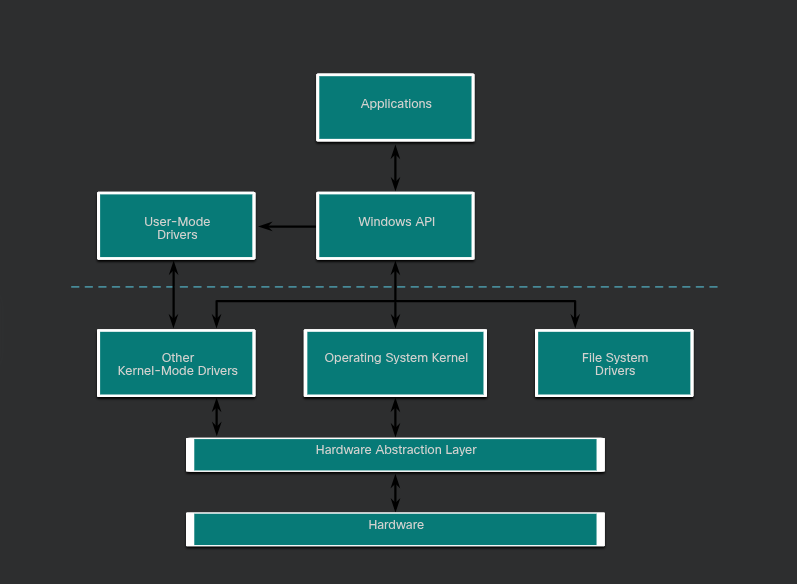

Another salient point is that the Hardware Abstraction Layer(HAL) is responsible for communicating with the kernel and the hardware. In some cases the kernel still communicates with the hardware directly, it is not completely independent of HAL.

### Windows Registry
it is an hierarchical DB. Now when  performing normal security audits, or remediating an infected system, review the application startup locations within the registry to ensure that each item is known and safe to run.
The registry also contains the activity that a user performs during normal day-to-day computer use. This includes the history of hardware devices, including all devices that have been connected to the computer including the name, manufacturer and serial number. Other information, such as what documents a user and program have opened, where they are located, and when they were accessed is stored in the registry. This is all very useful information when a forensics investigation needs to be performed.

### Windows Management Instrumentation (WMI)
Used to manage remote computers. Some attacks today use WMI to connect to remote systems, modify the registry, and run commands. WMI helps them to avoid detection becausea it is common traffic, most often trusted by the network security devices and the remote WMI commands do not usually leave evidence on the remote host. Because of this WMI access should be strictly limited.

### Windows Security
examining the open ports in a system is very important to mitigate against cyber threats. Once this done any malicious app that is running can be closed with the neccessary tools by killing the process or background apps.

# Networking

### Ethernet Frame Fields
Minimum ethernet frame size = 64 bytes, Max is 1518 bytes, This includes all bytes from the destination MAC addr field through the frame check sequence (FCS) field. The preamble field is not included when describing the size of the frame.
Any frame less than 64 bytes in length is considered a “collision fragment” or “runt frame” and is automatically discarded by receiving stations. Frames with more than 1500 bytes of data are considered “jumbo” or “baby giant frames”.
Go and watch some YT vids on this

## ARP
ARP provides two basic functions: resolving IPv4 addresses to MAC addresses and maintaining a table of IPv4 to MAC address mappings. ARP messages are encapsulated in the ethernet frame.
IPv6 uses a similar process to ARP in IPv4. It is known as ICMPv6 Neighbor Discovery (ND). IPv6 uses neighbor solicitation and neighbor advertisement messages, similar to IPv4 ARP requests and ARP replies.

## Transport Layer
The transport layer is reponsible for the logical communication between applications. At the transport layer, each set of data flowing between a source application and a destination application is known as a conversation and is tracked separately. It is the responsibility of the transport layer to maintain and track these multiple conversations.

Most networks have a limitation on the amount of data that can be included in a single packet. Therefore, data must be divided into manageable pieces.
The transport layer also divides app data into blocks called segments or datagrams.
__Header Information:__ The transport layer protocol also adds header information containing binary data organized into several fields to each block of data. It is the values in these fields that enable various transport layer protocols to perform different functions in managing data communication.

For instance, the header information is used by the receiving host to reassemble the blocks of data into a complete data stream for the receiving application layer program.

The transport layer ensures that even with multiple application running on a device, all applications receive the correct data.
This layer uses port numbers to ID applications.

### Transmission Control Protocol(TCP)
terms to go and make some research on:
> Window size
> 
> Sliding window
> 
> SLAAC
> 
> Flow Control
> 
> Maximum Segment Size
> 
>To avoid & control congestion, TCP employs several congestion handling mechanisms, timers, & algos.

### The Network Layer
IP encapsulates the transport layer (the layer just above the network layer) segment or other data by adding an IP header - used to deliver the packet to the destination host.
IP protocol does not gurantee that all packets that are delivered are, in fact, received. Unreliable means that IP does not have the capability to manage and recover from undelievered or corrupt packets. This is because while IP packets are sent with information about the location of delivery, they do not contain info that can be processed to inform the sender whether delivery was successful. Packets may arrive at the destination corrupted, out of sequence, or not at all. IP provides no capability for packet retransmissions if errors occur. When this happens applications using data or upper layer services, must resolve these issues. This allows IP to function very efficiently. In the TCP/IP Protocal suite, reliability is the role of the TCP protocol at the transport layer.

`Your research that you should do is:`
Part of the control communication between the data link layer and the network layer is the establishment of a maximum size for the packet. The data link layer passes the MTU value up to the network layer. The network layer then determines how large packets can be.
In some cases, an intermediate device, usually a router, must split up an IPv4 packet when forwarding it from one medium to another medium with a smaller MTU. This process is called fragmenting the packet, or fragmentation. Fragmentation causes latency. IPv6 packets cannot be fragmented by the router.

In digital logic, to ID  the network addr of an IPv4 host, the IP addr is logically ANDed, bit by bit, with the subnet mask. ANDing between the addr and the subnet mask yileds the network addr.

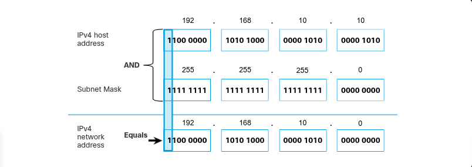

Something that is very important is that when building networks. if your broadcast domain is large, the hosts in it can generate excessive broadcasts and negatively affect the network by slowing down the network.
The solution is to reduce the size of the network to creat esmaller boardcast domains in a process called _subnetting_
Another role of the network layer is to direct packets between hosts. A host can send a packet to the following: itself loopback addr., Local host, the source and the destination share the same network addr., Remote host - destination host on a remote network. The source and destination hosts do not share the same network addr. 

Whether a packet is destined for a local host or a remote host is determined by the source end device. The source end device determines whether the destination IP addr. is on the same network that the source device itself is on. This method of determination is based on IP versions:
> IPv4 - The source device uses its own subnet mask along with its own IPv4 address and the destination IPv4 address to make this determination.

> IPv6 - The local router advertises the local network address (prefix) to all devices on the network.

### Default Gateway(DG)
It has a local IP address in the same address range as other hosts on the local network.
It can accept data into the local network and forward data out of the local network.
It routes traffic to other networks. Traffic cannot be forwarded outside the local network if there is no default gateway, the DG addr is not configured, or the DG is down.

### IPv6
340 undecillion, 340 followed by 36 zeros of possible IP addresses, part of the enhancement includes ICMPv6 which has address resolution and address autoconfiguration, unlike IPv4 which relies on NAT, although NAT has been instrumental in slowing the depletion of IPv4 address space. However NAT is problematic for many applications, creates latency, and has limitations that severely impede P2P comm.
There are some rules when reading or translating IPv6 addrs. 
> Rule 1: The first rule to help reduce the notation of IPv6 addresses is to omit any leading 0s (zeros) in any hextet. Here are four examples of ways to omit leading zeros:
    01ab can be represented as 1ab

    09f0 can be represented as 9f0
    
    0a00 can be represented as a00
    
    00ab can be represented as ab
    
    This rule only applies to leading 0s, NOT to trailing 0s, otherwise the address would be ambiguous.

fe80:0000:0000:0000:0123:4567:89ab:cdef
    
    without no leading zero: 

        fe80:0:0:0:123:4567:89ab:cdef
> Rule 2: a double colon (::) can replace any single, contiguous string of one or more 16-bit hextets consisting of all zeros. For example, 2001:db8:cafe:1:0:0:0:1 (leading 0s omitted) could be represented as 2001:db8:cafe:1::1. The double colon (::) is used in place of the three all-0 hextets (0:0:0)
    The double colon (::) can only be used once within an address, otherwise there would be more than one possible resulting address. When used with the omitting leading 0s technique, the notation of IPv6 address can often be greatly reduced. This is commonly known as the compressed format.

fe80:0000:0000:0000:0123:4567:89ab:cdef

  applying rule 2:

    fe80::123:4567:89ab:cdef

fe80:0123:4567:89ab:cdef:0000:0000:0000:

 applying rule 2:

    fe80:0123:4567:89ab:cdef::

### ICMP
_Time exceeded_
when TTL is decremented to 0. ICMPv6 does its own by hop limit field oto determine if the packet has expired, does not have the TTL field unlike the ICMPv4.

_jSome terms in ICMP:_
Router Solicitation(RS), Router Advertisement(RA), Neighbour Solicitation(NS), Neighbour Ad(NA),
Duplicate Address Detection(DAD)- this process is used by ICMPv6 to verify that an IPv6 addr is unique before configuring it on an interface, by sending a Neighbour Solicitation message to the IPv6 addr.

> __Ping__: Ping can be used to test the internal configuration of IPv4 or IPv6 on the local host. To perform this test, ping the local loopback address of 127.0.0.1 for IPv4 (::1 for IPv6).

    A response from 127.0.0.1 for IPv4, or ::1 for IPv6, indicates that IP is properly installed on the host. This response comes from the network layer. This response is not, however, an indication that the addresses, masks, or gateways are properly configured. Nor does it indicate anything about the status of the lower layer of the network stack. This simply tests IP down through the network layer of IP. An error message indicates that TCP/IP is not operational on the host.
> ___ICMP Packet Format__:  ICMP is encapsulated directly into IP packets. In this sense, it is almost like a transport layer protocol, because it is encapsulated into a packet, however it is considered to be a Layer 3 protocol. ICMP acts as a data payload within the IP packet. It has a special header data field, as shown in the figure.

    ICMP uses message codes to differentiate between different types of ICMP messages. These are some common message codes:

    0 - Echo reply (response to a ping)
    3 - Destination Unreachable
    5 - Redirect (use another route to your destination)
    8 - Echo request (for ping)
    11 - Time Exceeded (TTL became 0)

### DHCP
DHCPv4 uses DORA + NACK if the requested address is no longer valid or available.
DHCPv6 uses ....

### DNS
Do some research on this:
>_A recent analysis of network security threats discovered that over 90% of malicious software exploits use the DNS system to carry out network attack campaigns. A cybersecurity analyst should have a thorough understanding of the DNS system and the ways in which malicious DNS traffic can be detected through protocol analysis and the inspection of DNS monitoring information. In addition, malware frequently contacts command-and-control servers by using DNS. This makes the server URLs indicators of compromise for specific exploits._

### The DNS Lookup Process
To understand DNS, cybersecurity analysts should be familiar with the following terms:

`Resolver` - A DNS client that sends DNS messages to obtain information about the requested domain name space.

`Recursion` - The action taken when a DNS server is asked to query on behalf of a DNS resolver.

`Authoritative Server` - A DNS server that responds to query messages with information stored in Resource Records (RRs) for a domain name space stored on the server.

`Recursive Resolver` - A DNS server that recursively queries for the information asked in the DNS query.

`FQDN` - A Fully Qualified Domain Name is the absolute name of a device within the distributed DNS database.

`RR` - A Resource Record is a format used in DNS messages that is composed of the following fields: NAME, TYPE, CLASS, TTL, RDLENGTH, and RDATA.

`Zone` - A database that contains information about the domain name space stored on an authoritative server.

When attempting to resolve a name to an IP address, a user host, known in the system as a resolver, will first check its local DNS cache. If the mapping is not found there, a query will be issued to the DNS server or servers that are configured in the network addressing properties for the resolver. These servers may be present at an enterprise or ISP. If the mapping is not found there, the DNS server will query other higher-level DNS servers that are authoritative for the top-level domain in order to find the mapping. These are known as recursive queries.

Because of the potential burden on authoritative top-level domain servers, some DNS servers in the hierarchy maintain caches of all DNS records that they have resolved for a period of time. These caching DNS servers can resolve recursive queries without forwarding the queries to higher level servers. If a server requires data for a zone, it will request a transfer of that data from an authoritative server for that zone. The process of transferring blocks of DNS data between servers is known as a ___zone transfer___.

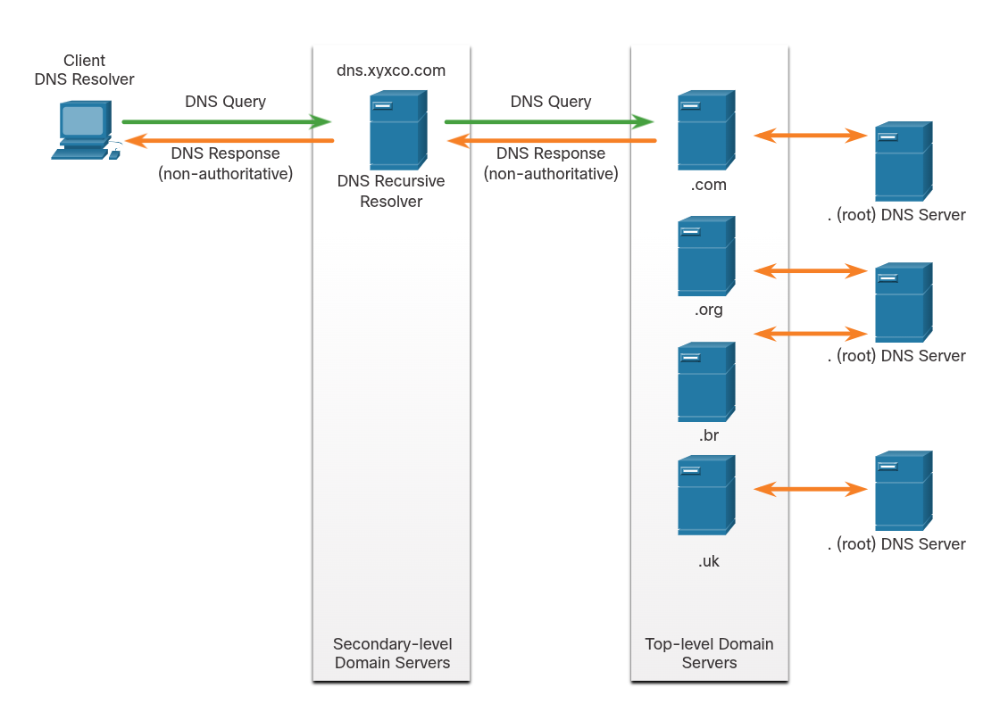

__Steps involved in DNS resolution:__

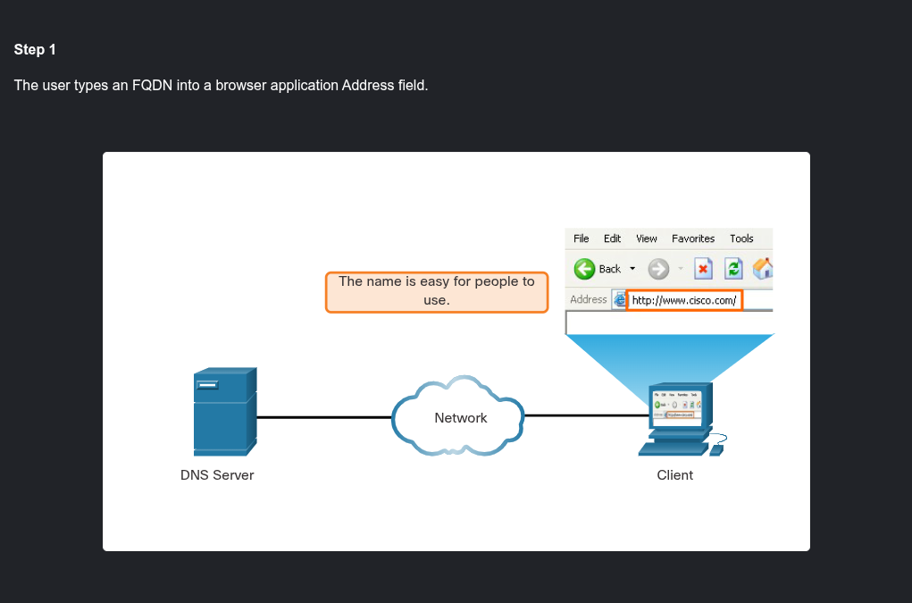

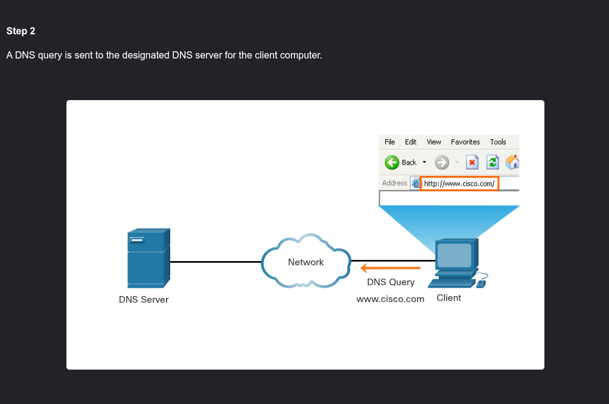

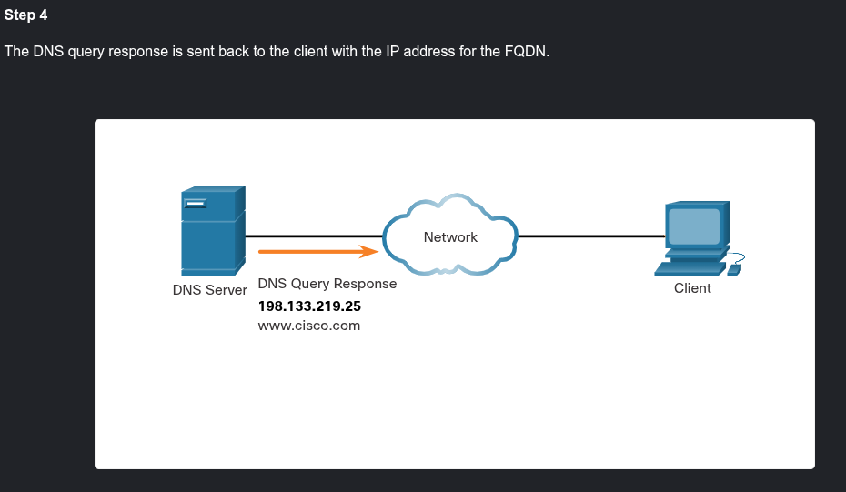

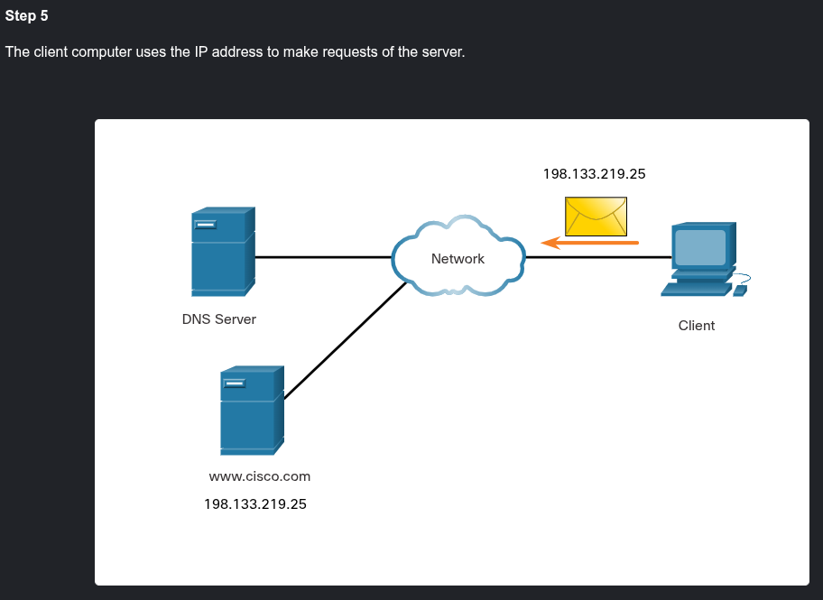

### Dynamic DNS
DNS requires registrars to accept and distribute DNS mappings from organizations that wish to register domain name and IP address mappings. After the initial mapping has been created, a process which can take 24 hours or more, changes to the IP address that is mapped to the domain name can be made by contacting the registrar or using an online form to the make the change. However, because of the time it takes for this process to occur and the new mapping to be distributed in domain name system, the change can take hours before the new mapping is available to resolvers. In situations in which an ISP is using DHCP to provide addresses to a domain, it is possible that the address that is mapped to the domain could expire and a new address be granted by the ISP. This would result in a disruption of connectivity to the domain through DNS. A new approach was necessary to allow organizations to make fast changes to the IP address that is mapped to a domain.

Dynamic DNS (DDNS) allows a user or organization to register an IP address with a domain name as in DNS. However, when the IP address of the mapping changes, the new mapping can be propagated through the DNS almost instantaneously. For this to occur, a user obtains a subdomain from a DDNS provider. That subdomain is mapped to the IP address of the user’s server, or home router connection to the internet. Client software runs on either the router or a host PC that detects a change in the internet IP address of the user. When a change is detected, the DDNS provider is immediately informed of the change and the mapping between the user’s subdomain and the internet IP address is immediately updated, as shown in the figure. DDNS does not use a true DNS entry for a user’s IP address. Instead, it acts as an intermediary. The DDNS provider’s domain is registered with the DNS, but the subdomain is mapped to a totally different IP address. The DDNS provider service supplies that IP address to the resolver’s second level DNS server. That DNS server, either at the organization or ISP, provides the DDNS IP address to the resolver.

Dynamic DNS can be abused by threat actors in various ways. Free DDNS services are especially useful to threat actors. DDNS can be used to facilitate the rapid change of IP address for malware command-and-control servers after the current IP address has become widely blocked. In this way, the malware can be coded with a URL rather than a static IP address. DDNS can also be used as a way to exfiltrate data from inside a network because DNS traffic is very common and is frequently considered to be benign. DDNS itself is not malignant, however monitoring DNS traffic that is going to known DDNS services, especially free ones, is very useful for the detection of exploits.

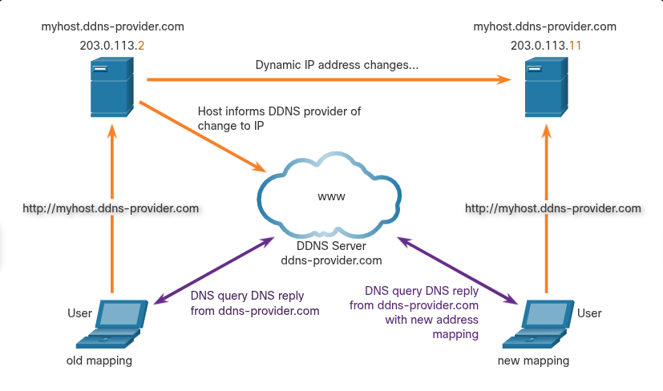

__Summary for DNS__

The Domain Name System (DNS) was developed to provide a reliable means of managing and providing domain names and their associated IP addresses. The DNS system consists of a global hierarchy of distributed servers that contain databases of name to IP address mappings. Cybersecurity analysts should have a thorough understanding of DNS because a recent analysis of network security threats discovered that over 90% of the malicious software that is used to attack networks uses the DNS system to carry out attack campaigns.

The following are the steps involved in DNS resolution:

The user types an FQDN into a browser address field.
A DNS query is sent to the designated DNS server.
The DNS server matches the FQDN with its IP address.
The DNS query response is sent back to the client with the IP address for the FDQN.
The client computer uses the IP address to send requests to the server.
DNS uses UDP port 53 for DNS queries and responses. The DNS server stores different types of RRs used to resolve names. These records contain the name, address, and type of record. DNS uses the same message format between servers, consisting of a question, answer, authority, and additional information for all types of client queries and server responses, error messages, and transfer of resource record information. Dynamic DNS (DDNS) allows a user or organization to register an IP address with a domain name as in DNS. However, when the IP address of the mapping changes, the new mapping can be propagated throughout the DNS almost instantaneously. DDNS can be abused by threat actors in various ways and URLs that use DDNS should be suspect. WHOIS is a TCP-based protocol that is used to identify owners of internet domains through the DNS system. WHOIS has limitations, and hackers have ways of hiding their identities.

## Network Devices

___Router___
What are the routing algos involved in determining the best paths between diff segment i the network.

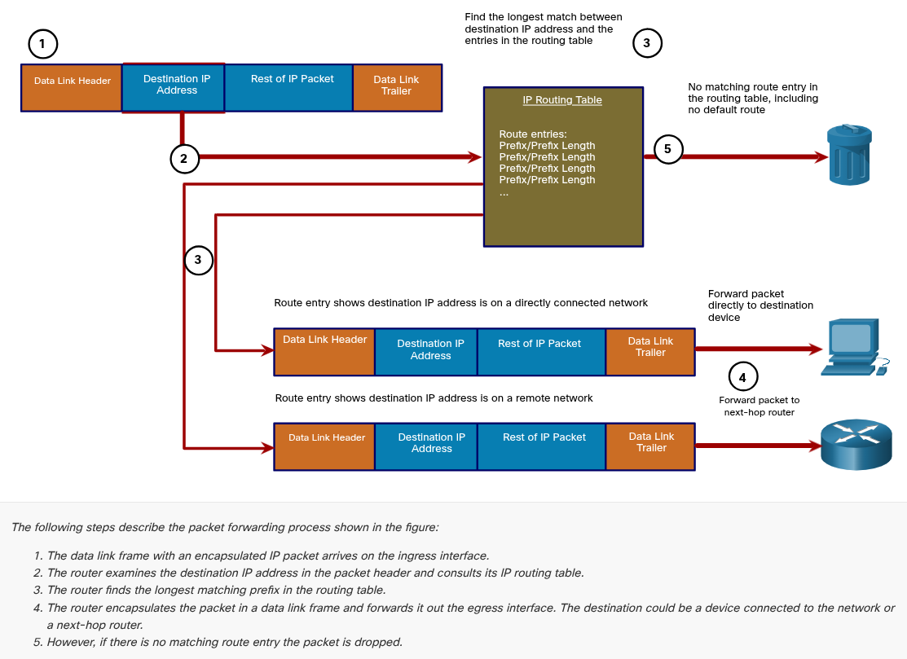
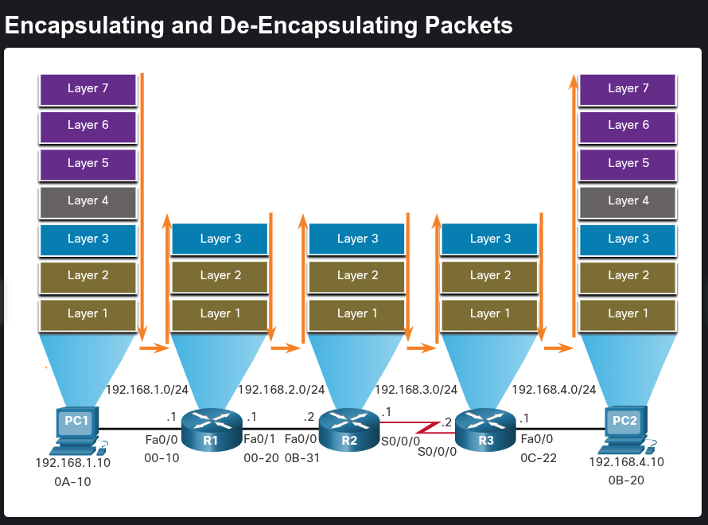
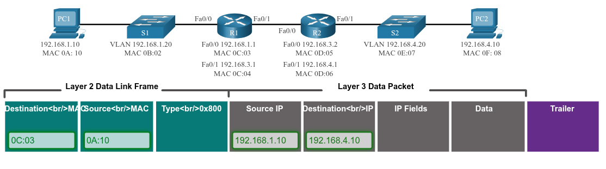

## ARP Vulns
includes ARP cache poisoning attack. The threat actor carries out a MiTM attack.

## DNS Attacks
incs:
> DNS Open resolver,

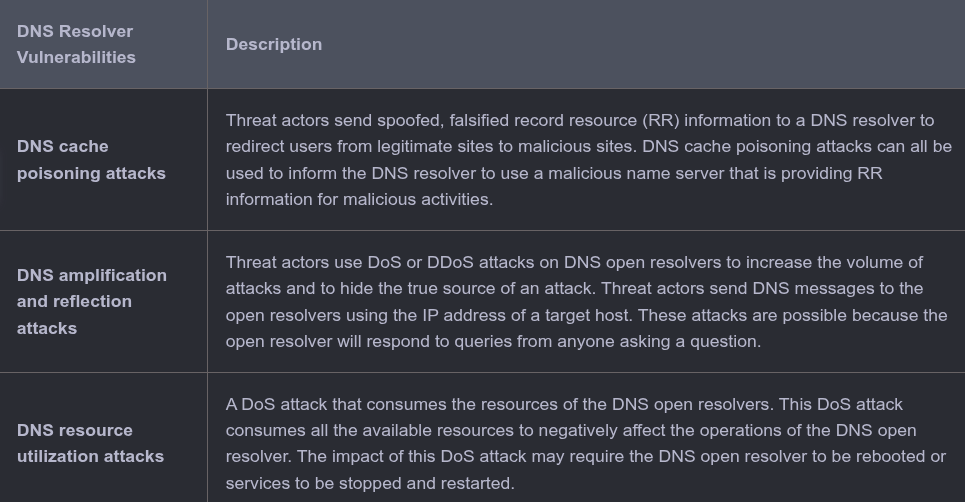

> DNS Stealth,

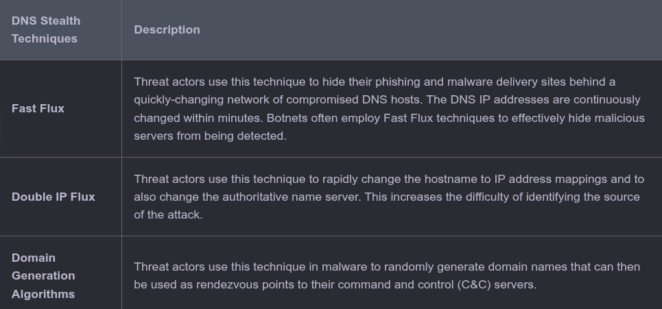

> DNS Domain Shadowing,
Domain shadowing involves the threat actor gathering domain account credentials in order to silently create multiple sub-domains to be used during the attacks. These subdomains typically point to malicious servers without alerting the actual owner of the parent domain.

> DNS tunneling attacks.

